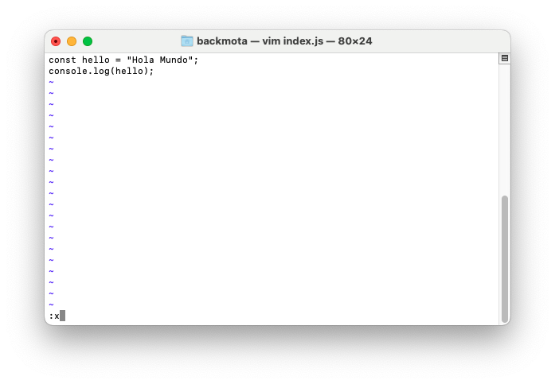

[`Programación con JavaScript`](../Readme.md) > `Módulo 1 - Clase 1`

## Tabla de Contenidos

- Introducción a JavaScript
- Añadiendo Script
- Herramientas para desarrolladores
- Fundamentos de la sintaxis
- Variables y tipos
- Interacción con el usuario
- Operadores principales
- Números
- Líneas
- Operadores lógicos

## Creando un archivo JS en la terminal o git bash 

1. Creando un archivo JavaScript utilizando la Terminal(Linux o Mac) o con GitBash.

Al abrir la terminal vamos a generar una carpeta donde vamos alojar nuestros archivos de JavaScript con el comnado 

```javascript
mkdir js
```

Ya que tenemos creado nuestra carpeta podemos acceder a ella por medio del comando *cd js* y una vez accedido a nuestro directorio vamos a crear un archivo .js con el comando 

```javascript
vim script.js
```

Para poder acceder al modo de escritura pulsaremos una unica ocasión la tecla **i** , en la parte inferior de la pantalla identificaremos que cambia a --INSERT-- y procederemos a escribir nuestra primera variables 

```javascript
const hello = "Hola Mundo";
console.log(hello);
```

Para guardar la información será necesario pulsar la tecla **esc** seguido por la tecla **:** y agregaremos una x, despues pulsaremos enter.



Ya creado nuestro archivo podemos visualizarlo en la terminal con el comando **ls** , para abrir un archivo desde nuestra terminal podemos utilizar el siguiente comando.

```javascript
open -a "Firefox ./script.js" 
```

Notaremos que el archivo se abre en texto plano y en la consola no nos da ninguna información de salida, esto se debe a que necesitamos de un archivo html para que nuestro navegador pueda interpretar JavaScript, procedemos a crear un archivo html desde nuestro editor de textos al mismo nivel donde se encuentra nuestra carpeta **js** 

El códgio base sería el siguiente:

```HTML
<!DOCTYPE html>
<html lang="en">
  <head>
    <meta charset="UTF-8" />
    <title>JavaScript is fun!</title>
    <script src="js/script.js">
    </script>
  </head>

  <body>
    <!-- contenido -->
   
  </body>
</html>
```
